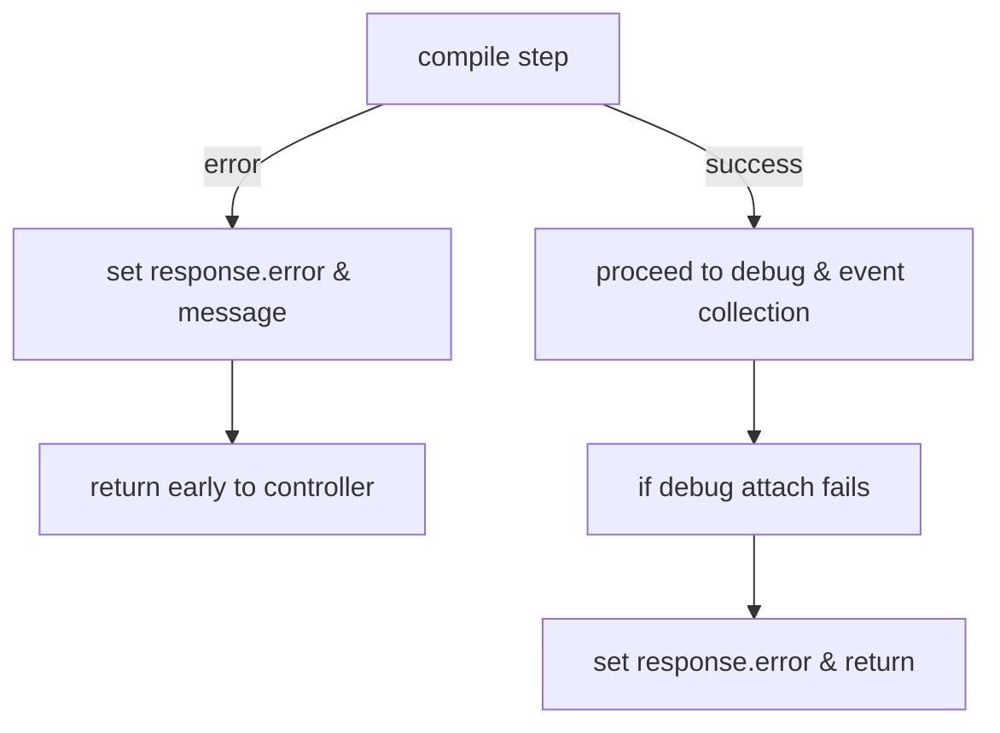

# Execution Flow Diagram

This document describes the end-to-end execution flow for running user code from the frontend to the backend and back to the frontend visualization. The system accepts requests that may claim any language, but the backend routes execution through the Java execution pipeline only.

## High-level flow

Frontend (UI) -> HTTP POST `/api/execute` -> `ExecutionController.execute()` -> `JavaExecutionService.execute()` -> (compile -> debug -> build steps) -> `ExecutionResponse` -> Frontend receives response -> Visualization components render steps

## Detailed step-by-step (functions & responsibilities)

- Frontend
  - `ControlBar.tsx::handleRun()`
    - Gathers editor code and selected language from the store.
    - Sends POST `/api/execute` with JSON body `{ code, language }`.
  - After response: sets `algorithmName`, `dataStructure`, `steps` in the visualizer store and starts playback.

- Backend (API)
  - `ExecutionController.execute(ExecutionRequest request)`
    - Receives the JSON request body as an `ExecutionRequest` (fields such as `code`, `language`, etc.).
    - IMPORTANT: Accepts any `language` value but unconditionally delegates to `JavaExecutionService.execute(request)`.
    - Returns the `ExecutionResponse` produced by the Java service.

- Java execution pipeline
  - `JavaExecutionService.execute(ExecutionRequest request)`
    - Sanitizes the incoming `code` (removes `package` declarations to avoid classpath issues).
    - `extractClassName(code)` — Attempts to find a class name from the source; falls back to `Main`.
    - Creates a temporary directory and writes `<ClassName>.java` source file.
    - Compiles the source via `javac -g <source>`.
      - On compilation error: populate `ExecutionResponse.error` and `ExecutionResponse.message` and return early.
    - Calls `JdiService.debug(tempDir, className)`
      - Launches the compiled program with JDWP / JDI (or attaches) and records low-level debug events (method calls, line events, variable states, etc.).
      - Returns a raw sequence/list of debug events.
    - Calls `StepBuilderService.buildSteps(events)`
      - Converts raw events into high-level `ExecutionStep` objects used by the frontend (line, code, description, nodes, variables, callStack, console, etc.).
    - Calls `StepBuilderService.detectPrimaryDs(steps)`
      - Heuristically inspects `ExecutionStep` data to detect a primary data structure (array, stack, linked-list, tree, etc.).
    - Populates `ExecutionResponse` fields: `steps`, `algorithmName`, `dataStructure`, etc.
    - Cleans up temporary files/directories.
    - Returns `ExecutionResponse`.

- Frontend rendering
  - `ControlBar.tsx` receives the `ExecutionResponse` and updates the visualizer store:
    - `setAlgorithmName(response.algorithmName)`
    - `setDataStructure(response.dataStructure)`
    - `setSteps(response.steps)`
    - `reset()` and `run()` to begin visualization playback.
  - Visualization components that consume store state:
    - `VisualizationPanel.tsx` — renders visual nodes/graph for current `ExecutionStep`.
    - `VariablesPanel.tsx` — renders variable values for the current step.
    - `TimelineBar.tsx` — allows scrubbing through `steps`.

## Notes about alternate debug endpoints used elsewhere

- There is also a lower-level debug/run flow used by `src/lib/javaExecution.ts`:
  - `generateJavaExecutionSteps(code, className)` -> POST `/api/run-java-debug` -> receives `runId` -> polls `/api/java-events?runId=...` -> transforms events via `javaTraceAdapter.javaEventsToSteps(events)` -> returns `ExecutionStep[]`.
  - That flow is for asynchronous debug runs (separate endpoints). The `/api/execute` endpoint described above uses `JavaExecutionService.execute()` which performs a compile+debug+convert sequence and returns a single `ExecutionResponse`.

## Error handling
- Compilation errors: `ExecutionResponse.error` and `ExecutionResponse.message` are set and returned. Frontend shows an error step in the UI.
- Execution exceptions: service catches exceptions, sets `ExecutionResponse.error`, and returns a meaningful message.

## Diagrams (Mermaid)

### Frontend: `handleRun()` flow

```mermaid
flowchart TD
  A[User clicks Run] --> B[handleRun()]
  B --> C[preparePayload()]
  C --> D[fetch('/api/execute')]
  D --> E[handleExecuteResponse()]
  E --> F[setAlgorithmName()]
  E --> G[setDataStructure()]
  E --> H[setSteps()]
  H --> I[reset()]
  I --> J[run()]
  D -->|network/error| Z[create error step & show in UI]
```

### Frontend: `generateJavaExecutionSteps()` (async debug path)

```mermaid
flowchart TD
  A[generateJavaExecutionSteps(code, className)] --> B[POST /api/run-java-debug]
  B --> C[receive { runId }]
  C --> D[poll /api/java-events?runId=...]
  D -->|events ready| E[javaEventsToSteps(events)]
  E --> F[return ExecutionStep[] to caller]
  D -->|timeout| G[return error step to caller]
```

### Backend: `ExecutionController.execute()` (API entry)

```mermaid
flowchart TD
  A[POST /api/execute] --> B[ExecutionController.execute(request)]
  B --> C[JavaExecutionService.execute(request)]
  C --> D[return ExecutionResponse]
```

### Backend: `JavaExecutionService.execute()` internals

```mermaid
flowchart TD
  A[JavaExecutionService.execute(request)] --> B[sanitizeCode() - remove package decls]
  B --> C[extractClassName(code)]
  C --> D[createTempDirectory() and write <Class>.java]
  D --> E[compile: javac -g <source>]
  E -->|compile error| F[populate ExecutionResponse.error/message & return]
  E -->|success| G[JdiService.debug(tempDir, className)]
  G --> H[StepBuilderService.buildSteps(events)]
  H --> I[StepBuilderService.detectPrimaryDs(steps)]
  I --> J[populate ExecutionResponse: steps, algorithmName, dataStructure]
  J --> K[cleanup tempDir]
  K --> L[return ExecutionResponse]
```

### Backend: `JdiService.debug()` (high-level)

```mermaid
flowchart TD
  A[JdiService.debug(tempDir, className)] --> B[launch target JVM with JDWP]
  B --> C[attach via LaunchingConnector/AttachingConnector]
  C --> D[subscribe to debug events (STEP, BREAKPOINT, METHOD_ENTRY, VAR_CHANGE)]
  D --> E[collect raw events list]
  E --> F[return events to caller]
```

### Backend: `StepBuilderService.buildSteps(events)`

```mermaid
flowchart TD
  A[buildSteps(events)] --> B[parse raw events]
  B --> C[group/merge events by line & frame]
  C --> D[construct ExecutionStep objects]
  D --> E[return ExecutionStep[]]
```

### Error & Edge Cases (compile / runtime)



## Summary
The diagrams above show the full call graph and error branches for the main frontend functions (`handleRun`, `generateJavaExecutionSteps`) and backend services (`ExecutionController`, `JavaExecutionService`, `JdiService`, `StepBuilderService`). They should be kept in sync with the implementation in `src/components/ControlBar.tsx`, `src/lib/javaExecution.ts`, and `java-backend/src/main/java/com/codestep/visualizer/service`.

## Combined Diagrams (detailed continuous flows)

### 1) Combined Frontend — Before Sending

This diagram shows the frontend work that happens before the HTTP request is made (validation, preparation, subflows).

```mermaid
flowchart TD
  Start[User edits code / clicks Run] --> Prep[handleRun() / preparePayload()]
  subgraph Frontend_Before[Combined Frontend — Before Sending]
    Prep --> Validate[validateInput()]
    Validate -->|invalid| ShowErr[create error step & show in UI]
    Validate -->|valid| Preproc[preprocessCode()]
    Preproc --> Normalize[normalizeLanguageAndOptions()]
    Normalize --> ClassName[normalizeClassName()/detectMainClass()]
    ClassName --> Finalize[finalizePayload()]
    Finalize --> Send[fetch POST /api/execute]
  end
  Send -->|request| BackendEntry
```

Notes:
- `validateInput()` contains sub-checks such as `validateNullInput()`, `validateParamTypes()`, and per-param `validateParam()` loops.

### 2) Combined Backend — Processing Request

This combined diagram shows the backend continuous flow and nested subflows from controller to services and error branches.

```mermaid
flowchart TD
  BackendEntry[HTTP POST /api/execute received] --> Controller[ExecutionController.execute(request)]
  subgraph Backend_Process[Combined Backend — Processing Request]
    Controller --> JavaExec[JavaExecutionService.execute(request)]
    JavaExec --> Sanitize[sanitizeCode()]
    Sanitize --> Extract[extractClassName(code)]
    Extract --> Write[createTempDirectory() & write <Class>.java]
    Write --> Compile[compile: javac -g <source>]
    Compile -->|error| CompileErr[populate ExecutionResponse.error & message]
    CompileErr --> ReturnErr[return error response]
    Compile -->|success| Launch[JdiService.debug(tempDir, className)]
    Launch --> Collect[collect raw debug events]
    Collect --> Build[StepBuilderService.buildSteps(events)]
    Build --> Detect[StepBuilderService.detectPrimaryDs(steps)]
    Detect --> Populate[populate ExecutionResponse (steps, algorithmName, dataStructure)]
    Populate --> Cleanup[cleanup tempDir]
    Cleanup --> ReturnOK[return ExecutionResponse to controller]
  end
  ReturnOK --> ControllerReturn[ExecutionController returns response]
  ControllerReturn --> Client[HTTP Response sent to frontend]
```

Subflows inside `validateInput()` and `buildSteps()` may themselves iterate over parameters/events (loops are represented conceptually above).

### 3) Combined Frontend — After Receiving Response

This diagram shows the frontend processing after receiving the backend response, including post-processing, error handling, and rendering.

```mermaid
flowchart TD
  Client[Frontend receives HTTP response] --> Handle[handleExecuteResponse(response)]
  subgraph Frontend_After[Combined Frontend — After Receiving Response]
    Handle --> CheckErr{response.error ?}
    CheckErr -->|yes| ShowError[create error step & show in UI]
    CheckErr -->|no| PostProc[postProcessResponse()]
    PostProc --> SetName[setAlgorithmName(response.algorithmName)]
    SetName --> SetDs[setDataStructure(response.dataStructure)]
    SetDs --> NormalizeSteps[normalize/validate steps]
    NormalizeSteps --> SetSteps[setSteps(response.steps)]
    SetSteps --> Initialize[reset()]
    Initialize --> Start[run()]
    Start --> Render[Visualization components render current step]
  end
  ShowError --> RenderError[UI shows compilation/runtime error details]
```

Each combined diagram is continuous and shows nested subflow calls where appropriate (e.g., validation contains parameter loops, backend buildSteps groups events into steps). Use these as canonical references when updating code paths.

